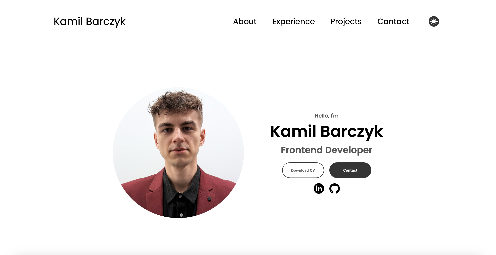
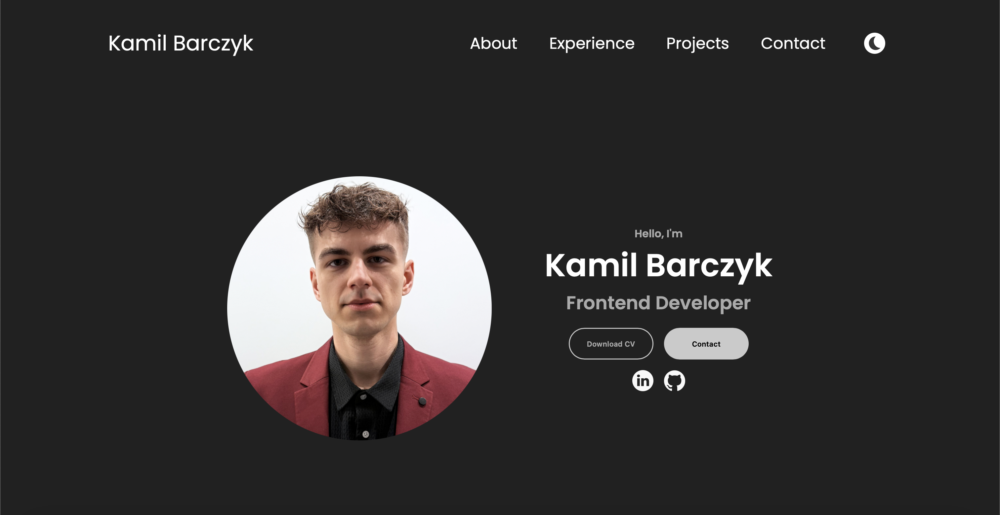

# Portfolio Website

This is a responsive portfolio webpage built with HTML, CSS, and minimal JavaScript. It serves as a personal online portfolio showcasing my projects, skills, and a contact section. Designed with simplicity and clarity in mind, this project aims to provide a user-friendly, visually appealing overview of my work.

## Features
- **Responsive Design**: Optimized for both desktop and mobile screens.
- **Light and Dark Mode**: Allows users to switch between light and dark modes to enhance the site's enjoyment in different lighting conditions.
- **About Section**: A brief introduction and overview of who I am.
- **Experience Section**: Highlights my technical skills along with the years of experience I have with each technology.
- **Projects Section**: Showcases my featured projects with images, GitHub links, and live demos.
- **Contact Section**: Enables visitors to send an email directly or visit my LinkedIn profile to connect.

## Technologies Used
- **HTML5**: Structure of the webpage.
- **CSS3**: Styling, including Flexbox and Grid for layout, media queries for responsive design, and support for light and dark modes using CSS variables for easier theme management.
- **JavaScript**: Used for minimal interactivity, including:
  - **Menu Toggle**: A function to handle the opening and closing of the hamburger menu.
  - **Light and Dark Mode**: Allows users to switch between light and dark modes, with icons changing accordingly, and the selected theme is saved using `localStorage`.

## Screenshots
**Light Mode**


**Dark Mode**


## Getting Started

To view or modify this project locally, follow these instructions.

### Prerequisites
- Ensure you have [Node.js](https://nodejs.org/) installed on your computer for using `live-server`.

### Installation and Local Development
1. **Clone the repository**:
   ```bash
   git clone https://github.com/KamilBarczyk/PortfolioWebsite.git

2. **Navigate to the project folder:**
   ```bash
   cd PortfolioWebsite

3. **Install live-server (if not already installed):**
   ```bash
   npm install -g live-server

4. **Run the project:**
   ```bash
   live-server

The site will automatically open in your default browser at http://localhost:8080.